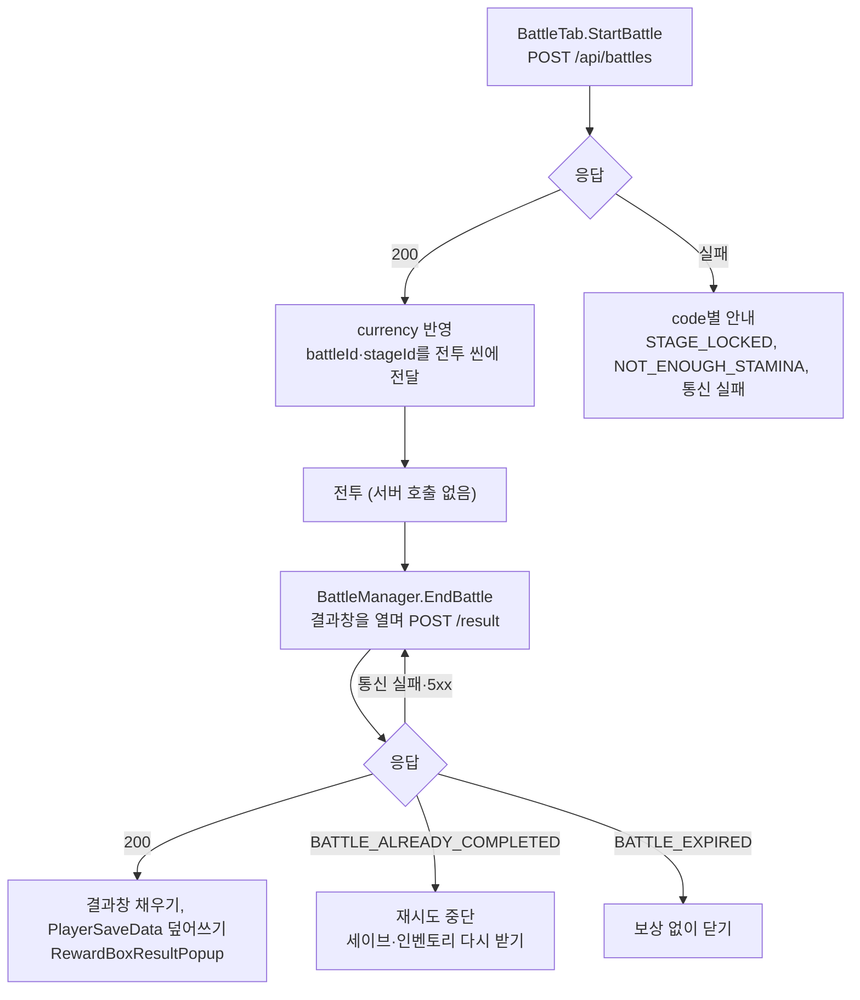

# 전투 API 사용 가이드

전투 입장과 결과를 서버로 처리하는 API와 클라이언트 연동 방법을 정리한다. 기준은 `DesignDecisions.md` 4번(전투 입장과 결과), 5번(스태미나 회복)이다. 클라이언트 변경 위치는 `BackendIntegration_DevAkasha.md` 3.1~3.4를 따른다.

## 1. 개요
- 입장: 서버가 해금과 스태미나를 검증해 차감하고 전투 ID를 발급한다. 클라이언트는 성공 응답을 받은 뒤 전투 씬으로 넘어간다.
- 전투 중: 서버를 호출하지 않는다.
- 결과: 결과창을 열 때 전투 ID와 집계값을 보낸다. 서버가 상한으로 검증하고 골드, 계정 경험치, 레벨업, 스테이지 진행, 최장 생존 시간, 보상상자 장비를 지급한다.
- 클라이언트는 재화, 경험치, 장비를 직접 바꾸지 않는다. 응답값을 `PlayerSaveData`에 덮어쓴다.

## 2. 엔드포인트
| 메서드 · 경로 | 용도 | 인증 |
|---|---|---|
| `POST /api/battles` | 입장 | Bearer 토큰 |
| `POST /api/battles/{battleId}/result` | 결과 | Bearer 토큰 |

에러 응답은 공통 형식 `{ "status", "code", "message" }`이다. 클라이언트는 `code`로 분기한다.

### 2.1 입장
요청 본문: `{ "stageId": 1 }`

응답 200:
| 필드 | 내용 |
|---|---|
| `battleId` | 결과 요청에 쓰는 전투 ID |
| `currency` | 차감 후 Currency. `GET /api/players/me/save`의 `currency`와 같은 형식 |

| code | 상태 | 상황 |
|---|---|---|
| `STAGE_NOT_FOUND` | 404 | 없는 stageId |
| `STAGE_LOCKED` | 400 | 해금되지 않은 스테이지. 첫 스테이지부터 maxClearedStageId 다음 스테이지까지만 입장할 수 있다 |
| `NOT_ENOUGH_STAMINA` | 400 | 회복을 반영해도 battleStaminaCost보다 적다 |
| `VALIDATION_FAILED` | 400 | stageId가 1보다 작다 |

새로 입장하면 결과를 보내지 않은 이전 전투는 만료된다. 만료된 전투는 보상을 주지 않고 스태미나도 돌려주지 않는다.

### 2.2 결과
요청 본문: `BattleResult`의 값 중 다섯 개를 보낸다. StageId는 서버가 전투 ID로 알고, AccountExp는 서버가 계산하므로 보내지 않는다.

```json
{ "victory": true, "seconds": 120, "kills": 80, "gold": 900, "rewardBoxes": 4 }
```

응답 200:
| 필드 | 내용 |
|---|---|
| `grantedGold` | 지급한 골드(상한 적용 후) |
| `grantedExp` | 지급한 계정 경험치 |
| `profile` | 지급 후 PlayerProfile. 레벨업 여부는 이전 accountLevel과 비교한다 |
| `currency` | 지급 후 Currency |
| `stageProgress` | 갱신된 StageProgress |
| `stageRecord` | 이 스테이지의 최장 생존 시간 `{ stageId, bestSurvivalSeconds }` |
| `rewards` | 보상상자로 지급한 장비. `GET /api/inventory`의 `items`와 같은 형식 |

| code | 상태 | 상황 |
|---|---|---|
| `BATTLE_NOT_FOUND` | 404 | 없는 battleId |
| `NOT_OWNED_BATTLE` | 403 | 다른 플레이어의 전투 |
| `BATTLE_ALREADY_COMPLETED` | 409 | 이미 결과를 반영한 전투 |
| `BATTLE_EXPIRED` | 409 | 결과를 보내기 전에 새 전투에 입장했다 |
| `VALIDATION_FAILED` | 400 | 음수 값 |

## 3. 요청·응답 예시
로컬 서버(기본 포트 8080) 기준이다. `$TOKEN`은 로그인 응답의 `accessToken`이다.

```bash
# 입장
curl -X POST "http://localhost:8080/api/battles" \
  -H "Authorization: Bearer $TOKEN" -H "Content-Type: application/json" \
  -d '{"stageId":1}'

# 결과
curl -X POST "http://localhost:8080/api/battles/2/result" \
  -H "Authorization: Bearer $TOKEN" -H "Content-Type: application/json" \
  -d '{"victory":true,"seconds":9999,"kills":1000,"gold":99999,"rewardBoxes":50}'
```

입장 응답:

```json
{
  "battleId": 2,
  "currency": {
    "playerId": 1,
    "currencyGold": 0,
    "currencyGem": 0,
    "currencyEnergy": 50,
    "currencyEnergyUpdatedAt": "2026-10-08T03:12:35.639582Z"
  }
}
```

결과 응답(입장 3초 뒤 상한을 넘는 값을 보낸 경우, rewards 일부 생략):

```json
{
  "grantedGold": 5400,
  "grantedExp": 597,
  "profile": { "playerId": 1, "accountId": 1, "playerNickname": "verify1", "accountLevel": 3, "accountExp": 297 },
  "currency": { "playerId": 1, "currencyGold": 5400, "currencyGem": 0, "currencyEnergy": 50, "currencyEnergyUpdatedAt": "2026-10-08T03:12:35.639582Z" },
  "stageProgress": { "playerId": 1, "currentStageId": 1, "maxClearedStageId": 1 },
  "stageRecord": { "stageId": 1, "bestSurvivalSeconds": 8 },
  "rewards": [
    { "inventoryId": 1, "itemId": 5001, "inventoryItemLevel": 1, "inventoryItemGrade": "General", "isEquipped": false },
    { "inventoryId": 2, "itemId": 1001, "inventoryItemLevel": 1, "inventoryItemGrade": "General", "isEquipped": false }
  ]
}
```

seconds는 경과 3초 + 허용 5초인 8로, kills·gold·rewardBoxes는 1스테이지 상한(89, 5400, 9)으로 깎였다. 경험치는 `89 × 1 + 8 × 1 + 500 = 597`이고, 레벨 1에서 100, 200을 빼 레벨 3, 경험치 297이 됐다.

## 4. 클라이언트에서 쓰기
요청 방식은 `DesignDecisions.md` 6번(코루틴과 콜백, UI마다 요청 중 상태)을 따른다.



### 4.1 입장 (`BattleTab.StartBattle`)
- `PlayerInventory.TrySpendStamina` 대신 입장 요청을 보낸다. `TrySpendStamina`는 삭제한다.
- 200이면 `currency`를 `PlayerSaveData.currency`에 덮어쓰고 `NotifyPlayerDataChanged`를 호출한 뒤 `ChangeScene`한다.
- `battleId`는 `GameSceneManager.pendingStageId`와 함께 전투 씬에 넘긴다.
- `StageSelectScreen`에서 잠긴 스테이지를 고르지 못하게 막는다. 서버도 `STAGE_LOCKED`로 거부한다.

### 4.2 결과 (`BattleManager.EndBattle`, `BattleResultWindow`)
- 결과창을 열면서 보낸다. 킬 수와 생존 시간은 바로 표시하고, 경험치·골드·레벨업·보상상자는 응답을 받은 뒤 표시한다.
- 200이면
  - `profile`, `currency`, `stageProgress`를 `PlayerSaveData`에 덮어쓴다.
  - `stageRecord`를 `stageRecordList`에 반영한다.
  - `rewards`를 `OwnedItem`으로 바꿔(`PlayerInventory.Load`와 같은 변환) 인벤토리에 넣고 `RewardBoxResultPopup`을 띄운다.
  - `NotifyPlayerDataChanged`를 호출한다.
- 통신 실패와 5xx는 같은 battleId로 다시 보낸다.
- `BATTLE_ALREADY_COMPLETED`는 첫 요청이 반영됐는데 응답을 받지 못한 경우다. 재시도를 멈추고 `GET /api/players/me/save`와 `GET /api/inventory`로 다시 받는다. 이때 결과창에 지급값은 표시할 수 없다.
- battleId가 없으면(메인 씬 없이 `WaveManager.stageId` 기본값으로 실행) 보내지 않는다.
- 삭제 대상: `BattleResult.Last`를 거친 지급(`PlayerInventory.ClaimBattleResult`), `BattleManager`의 accountExp 계산.

### 4.3 세이브 로드
- `GET /api/players/me/save` 응답에 `stageRecords: [{ stageId, bestSurvivalSeconds }]`가 추가됐다. 최장 생존 시간 표시(`StageSelectScreen`, `BattleTab`)에 쓴다. 지금 `MainUIAccountBinder`가 0을 넘기는 곳이다.
- `currency.currencyEnergy`는 회복을 반영한 값이다.

### 4.4 스태미나 회복 표시
서버는 `staminaRecoverySeconds`(300초)마다 1씩, maxStamina까지 회복한다. 클라이언트는 같은 공식으로 표시만 하고, 차감과 판정은 서버 응답을 쓴다. `ServerNow`는 `ServerTime.md` 5장의 추정 서버 시각이다.

```csharp
// 표시용 스태미나. 서버 Currency.recoverEnergy와 같은 공식
int DisplayEnergy(int energy, DateTimeOffset updatedAt, AccountConstData c)
{
    if (energy >= c.maxStamina) return energy;
    long recovered = (long)(ServerNow - updatedAt).TotalSeconds / c.staminaRecoverySeconds;
    return (int)Math.Min(c.maxStamina, energy + Math.Max(0, recovered));
}

// 다음 1 회복까지 남은 초
long elapsed = (long)(ServerNow - updatedAt).TotalSeconds;
long remain = c.staminaRecoverySeconds - elapsed % c.staminaRecoverySeconds;
```

클라이언트 `AccountConstData`에 `staminaRecoverySeconds` 필드를 추가해야 한다.

### 4.5 시각 형식
- `currencyEnergyUpdatedAt`은 ISO-8601 UTC(`Z`)로 나간다. `DateTimeOffset.Parse`로 읽는다.
- `PUT /api/players/me/save`로 보내는 `currencyEnergyUpdatedAt`도 서버가 `Instant`로 받으므로 `Z`나 오프셋이 붙은 형식으로 보낸다.

## 5. 서버 규칙

### 5.1 상한 검증
| 값 | 상한 |
|---|---|
| seconds | 입장 시각부터 결과 수신 시각까지의 경과 초 + 5초 |
| kills | 웨이브의 전체 스폰 수. 상자(Box)는 킬로 세지 않으므로 뺀다 |
| gold | 스폰마다 드롭 테이블의 최대 골드를 더한 값 + 행운상자 최대 개수 × luckTrainGoldMax × 5 |
| rewardBoxes | 스폰마다 드롭 테이블의 RewardBox 최대 개수를 더한 값 |

- 넘으면 상한까지만 지급하고 서버 로그에 남긴다. 요청을 거부하지 않는다.
- victory는 검증하지 않는다.
- kills, gold, rewardBoxes 상한은 서버를 시작할 때 스테이지별로 계산한다.
  - 반복 스폰은 `floor(patternDuration / max(spawnInterval, 0.1)) + 1`회로 센다. 클라이언트가 간격을 float로 누적해 한 번 더 나올 수 있어서다.
  - 드롭 테이블은 연속된 같은 dropGroup마다 1행을 뽑으므로 그룹별 최대값을 더한다.
  - 행운상자 하나마다 행운열차가 한 번 돌고, 골드는 최대 goldMax × 5(최대 당첨 칸 수)다.
- 현재 데이터 기준 1스테이지 상한은 kills 89, gold 5400, rewardBoxes 9다.

### 5.2 지급
- 골드: 검증한 gold를 더한다.
- 계정 경험치: `kills × accountExpPerKill + seconds × accountExpPerSecond + 승리 시 clearAccountExp`. 현재 레벨 기준으로 저장한다. 필요 경험치(`accountBaseRequiredExp + accountRequiredExpIncrement × (레벨 - 1)`)를 채울 때마다 빼고 레벨을 올리며, 최대 레벨에서는 경험치만 쌓인다.
- StageProgress: currentStageId를 전투한 스테이지로 바꾸고, 승리했고 더 높으면 maxClearedStageId를 갱신한다.
- StageRecord: 승패와 관계없이 seconds가 더 길면 bestSurvivalSeconds를 갱신한다.
- 보상상자: 상자마다 Stage의 rewardBoxGradeWeights로 등급을 뽑고, 그 등급이 기본 등급인 장비 중 하나를 균등하게 골라 지급한다.

## 6. 주의사항 및 FAQ
- **AccountConst 새 열:** `staminaRecoverySeconds`, `accountExpPerKill`, `accountExpPerSecond`, `luckTrainGoldMax`는 아직 시트에 없고 서버 JSON에만 임시로 넣었다. dev에 머지할 때 시트에 열을 추가하고 Export한다. 열 없이 Export하면 서버가 시작하지 않는다.
- **클라이언트 임시값과 맞추기:** 아래 값은 클라이언트 코드에도 따로 있다. 한쪽만 바꾸면 경험치 표시나 상한이 어긋난다. 클라이언트도 AccountConst에서 읽도록 바꾼다.

  | 서버 | 클라이언트 |
  |---|---|
  | AccountConst `accountExpPerKill`, `accountExpPerSecond` | `BattleManager` 인스펙터 |
  | AccountConst `luckTrainGoldMax` | `PlayerLuckTrain.goldMax` |
  | `BattleService.LUCK_TRAIN_MAX_PICKS` (5) | `PlayerLuckTrain`의 최대 당첨 칸 수 |
  | `BattleService.MIN_SPAWN_INTERVAL` (0.1) | `WaveManager.minRepeatInterval` |
- **같은 전투 결과가 동시에 두 번 오면?** 입장과 결과는 Currency 행과 세션 행을 잠그고 처리하므로 한 번만 지급한다. 늦게 온 요청은 `BATTLE_ALREADY_COMPLETED`를 받는다.
- **결과를 보내기 전에 앱을 끄면?** 결과가 사라지고, 다음 입장 때 그 전투는 만료된다.
- **`PUT /api/players/me/save`는?** 클라이언트가 보낸 재화, 경험치, 레벨, 스테이지를 그대로 저장하므로 이 검증을 거치지 않는다.
- **로컬 DB:** `currencyEnergyUpdatedAt`을 UTC `Instant`로 바꿨다. 기존 로컬 DB 값은 KST로 들어가 있어 9시간 어긋나므로 초기화한다.
- **설계 배경은?** `Docs/ETC/DesignDecisions.md` 4번, 5번에 있다.
